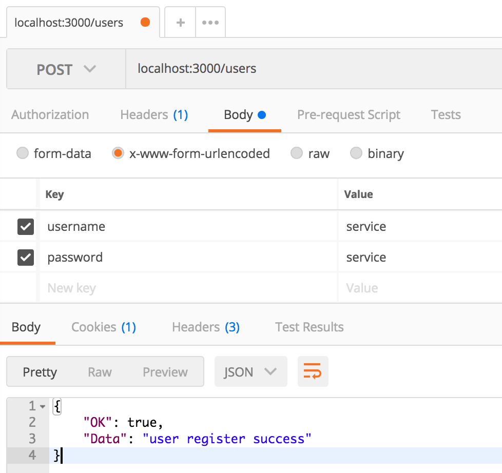
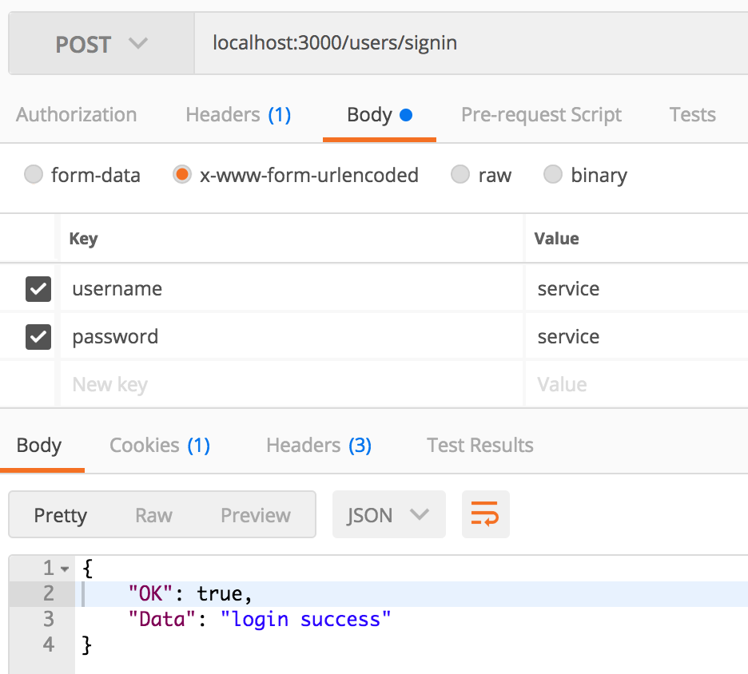

# go-agenda

[](https://travis-ci.org/painterdrown/go-agenda.svg?branch=master)

> Agenda based on Go, with CLI and service.

## 生成 Docker 镜像

```bash
docker build -t go-agenda .
```

## Docker 使用方法

+ 下载项目并构建镜像
  ```bash
  # docker pull painterdrown/go-agenda  由于构建 Docker 镜像时不能翻墙下载 golang.org 的一些 package 因此没有 push 到 Docker Hub 上。但是再 Travis CI 中是可以成功构建镜像的。 
  go get -u github.com/painterdrown/go-agenda
  cd $GOPATH/src/github.com/painterdrown/go-agenda
  docker build . -t go-agenda
  ```

+ 启动 service 服务器
  ```bash
  docker run --name go-agenda-sevice -d -v $DATA_PATH:/data -p 3000:3000 go-agenda service
  ```
  > 其中，$DATA_PATH 是你本地对某个路径，用来存储 go-agenda 的数据文件。<br/>
  > 比如：docker run --name go-agenda-sevice -d -v ~:/data -p 3000:3000 go-agenda service<br/>
  > 成功后访问 localhost:3000 来使用 go-agenda-service

+ 运行 cli 客户端
  ```bash
  docker run --name go-agenda-cli -v $DATA_PATH:/data go-agenda cli [COMMAND] [ARG...]
  ```
  > 比如：docker run --name go-agenda-cli -v ~:/data go-agenda cli --help<br/>

+ Travis CI 地址
  > https://travis-ci.org/painterdrown/go-agenda
  

## Usage of cli

### 用户部分

+ 用户注册
  ```bash
  cli register -u test -p test
  ```

+ 用户登录
  ```bash
  cli login -u test -p test
  ```

+ 查询所有用户
  ```bash
  cli queryu
  ```

+ 用户登出
  ```bash
  cli logout
  ```

+ 删除用户（将已登录的用户删除）
  ```
  cli delu
  ```

### 会议部分（用户需先登录）

+ 创建会议（需先注册好用户 test1 和 test2）
  ```bash
  cli cm -t golang -p test1,test2, -s 2017-09-09/21:00:00 -e 2017-09-09/23:00:00
  ```

+ 添加参与者（需先注册好用户 test3）
  ```bash
  cli addp -t golang -p test3
  ```

+ 删除参与者
  ```bash
  cli delp -t golang -p test3
  ```

+ 根据时间区间查询会议
  ```bash
  cli querym -s 2017-09-09/21:00:00 -e 2017-09-09/23:00:00
  ```

+ 删除会议（如果是发起者，则删除该会议；如果是参与者，则退出该会议）
  ```bash
  cli delm -t golang
  ```
+ 清除所有会议（如果是发起者，则删除会议；如果是参与者，则退出会议）
  ```bash
  cli clearm
  ```

## Usage of service

+ 用户注册（application/x-www-urlencoded）
  

+ 用户登陆（application/x-www-urlencoded）
  

只给出上面两个例子，其它详见 API.html。

## 已完成的作业要求

+ [x] 重构、或新建 agenda 项目，根目录必须包含
  + cli 目录
  + service 目录
  + .travis（即 .travis.yml 文件）
  + apiary.apib
  + dockerfile（即 Dockerfile 文件）
  + LICENSE
  + README.md
  + README-yourid.md（即如下 md 文件）
    + README-painterdrown.md
    + README-weimumu.md
    + README-zhengbaic.md

+ [x] API 开发（详见 apiary.apib 文件及 API.html 文档）
  + 使用 API Blueprint 设计 API
  + 资源 URL 命名符合 RESTful 设计标准
  + 资源 CRUD 基本完整

+ [x] API 客户端开发（详见 cli 目录）
  + 可用命令 5 个以上
  + 必须有 XXX-test.go 文件（详见 entities 目录下的 _test.go 文件）

+ [x] 服务端开发（详见 service 目录）
  + 使用 sqlite3 作为数据库
  + 建议使用课程提供的服务端框架
  + 必须有 XXX-test.go 文件（详见 entities 目录下的 _test.go 文件）

+ [x] 容器镜像制作（详见 Dockerfile 文件）
  + 在 docker hub 上生成镜像
  + base 镜像 go-1.8
  + 需要加载 sqlite3
  + 同时包含客户端与服务器

+ [x] README.md
  + 有 build pass 标签
  + 有简短使用说明
  + 有系统测试的结果（包含如何下载镜像，如何启动服务器，如何使用命令行，cli 的 mock 测试结果， 综合系统测试结果）

+ [x] README-yourid.md
  + fork 项目的位置
  + 个人工作摘要（每次提交）
  + 项目小结