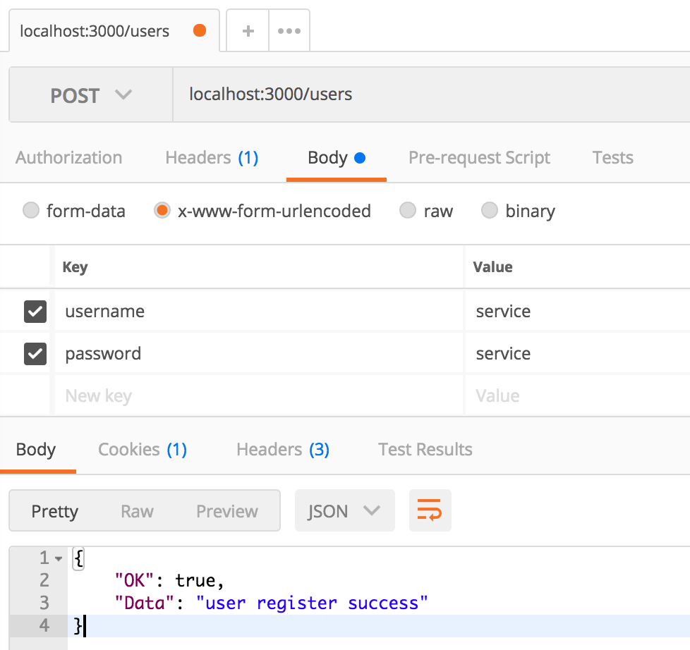
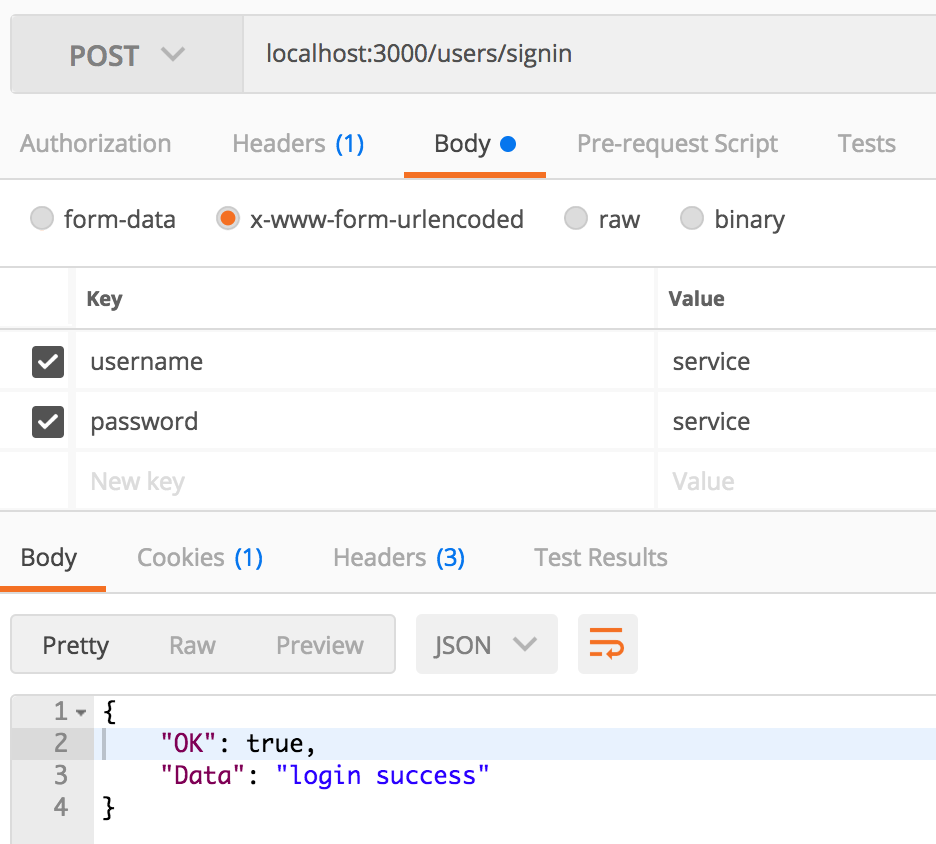

# go-agenda

[](https://travis-ci.org/painterdrown/go-agenda.svg?branch=master)

Agenda based on Go, with CLI and service.

## 生成 Docker 镜像

```bash
docker build -t go-agenda .
```

## Docker 使用方法

  + 下载镜像
    ```bash
    docker pull painterdrown/go-agenda
    ```

  + 启动 service 服务器
    ```bash
    docker run --name go-agenda-sevice -d -v $DATA_PATH:/data -p 3000:3000 go-agenda service
    ```
    > 其中，$DATA_PATH 是你本地对某个路径，用来存储 go-agenda 的数据文件。<br/>
    > 比如：docker run --name go-agenda-sevice -d -v ~:/data -p 3000:3000 go-agenda service<br/>
    > 成功后访问 localhost:3000 来使用 go-agenda-service

  + 运行 cli 客户端
    ```bash
    docker run --name go-agenda-cli -v $DATA_PATH:/data go-agenda cli [COMMAND] [ARG...]
    ```
    > 比如：docker run --name go-agenda-cli -v ~:/data go-agenda cli --help<br/>

## Usage of cli

### 用户部分

  + 用户注册
    ```bash
    cli register -u test -p test
    ```

  + 用户登录
    ```bash
    cli login -u test -p test
    ```

  + 查询所有用户
    ```bash
    cli queryu
    ```

  + 用户登出
    ```bash
    cli logout
    ```

  + 删除用户（将已登录的用户删除）
    ```
    cli delu
    ```

### 会议部分（用户需先登录）

  + 创建会议（需先注册好用户 test1 和 test2）
    ```bash
    cli cm -t golang -p test1,test2, -s 2017-09-09/21:00:00 -e 2017-09-09/23:00:00
    ```

  + 添加参与者（需先注册好用户 test3）
    ```bash
    cli addp -t golang -p test3
    ```

  + 删除参与者
    ```bash
    cli delp -t golang -p test3
    ```

  + 根据时间区间查询会议
    ```bash
    cli querym -s 2017-09-09/21:00:00 -e 2017-09-09/23:00:00
    ```

  + 删除会议（如果是发起者，则删除该会议；如果是参与者，则退出该会议）
    ```bash
    cli delm -t golang
    ```
  + 清除所有会议（如果是发起者，则删除会议；如果是参与者，则退出会议）
    ```bash
    cli clearm
    ```

## Usage of service

  + 用户注册（application/x-www-urlencoded）
    

  + 用户登陆
    

  只给出上面两个例子，其它详见 API.html。
